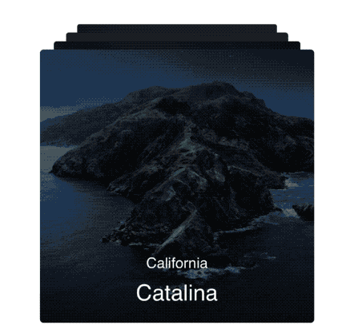

# Cardimation



Description
--------------

```Cardimation``` is a customizable card view written in Swift that can be used to show a collection of views like a deck of cards, with previous/forward swipe possibility.


Requirements
-----------------------------

iOS 12.0+

Installation
--------------

### CocoaPods

To integrate Cardimation into your Xcode project using CocoaPods, specify it in your `Podfile`:

```ObjC
pod 'Cardimation', :git => 'https://github.com/Cyklet/Cardimation.git', :tag => #tag
```

Then, run the following command:

```bash
$ pod install
```

### Carthage

To integrate Cardimation into your Xcode project using Carthage, specify it in your `Cartfile`:

```ObjC
github "Cyklet/Cardimation" ~> #tag
```

Run `carthage update` to build the framework and drag the built `Cardimation.framework` into your Xcode project.

### Manually

If you prefer not to use dependency managers, you can integrate `Cardimation` into your project manually.

Usage
--------------

Initialise the `CardsView` and add it to the super view.\
The next inputs are available for `CardsView.init`:
- *cards* -  An array of `CardRepresentation` items, that stores card and overlay information;

- *numberOfSlots* - Number of slots that will be visible on the screen. In the slot configuration, you can set up min and max number of the slots, by default these are set to 3 and 5.

- *configuration* - `CardsViewConfiguration` is an optional property; if it hasn't been set then it will have default values.

After creation, take into consideration that layout can be outdated, in this case, you can call `layoutIfNeeded`.
When you want to show cards call `show()` function.

Check the `CardimationExample` where you can see how the `CardsView` has been added on the simple view and on the cell in the table.

Configurations
--------------

| CardsViewConfiguration|
| --- |
| `general` - *CardsGeneralConfiguration* with cornerRadius, alphaDifference, swipeType properties |
| `geometrical` - *CardsGeometricalConfiguration* with scaleVariance, extremePointPosition, cardOffsets, cardSize properties |
| `slots` - *CardsViewSlotsConfiguration* that stores max and min available slots on the screen |  
| `animations` - *CardViewAnimationsConfiguration* with duration, delay, options properties |


| OverlayConfiguration |
| --- |
| `type` - OverlayType *none*(no overlay will be added on top of the card), *color*(simple colored overlay), *custom*(custom view) |
| `animationStyle` - *OverlayAnimationStyle* that describes how overlay will be hidden and showed: *unanimated*, *animated*(with duration, delay, options properties) |


| CardRepresentation |
| --- |
| `create` - Closure that will return a custom view of type *CardViewable* |
| `overlayConfiguration` - *OverlayConfiguration* with animationStyle, type properties |
| `displayTime` - TimeInterval that describes how long will the card be visible for |

License
--------------

MIT License, Copyright (c) 2019 [Petre Plotnic](https://www.linkedin.com/in/petre-plotnic/)
